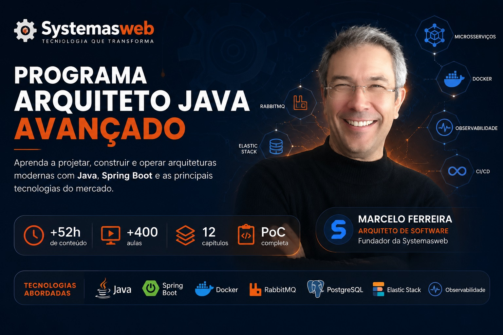

  

# Programa Arquiteto Java Avançado

**Evolua da implementação para decisões arquiteturais reais.**

O Programa Arquiteto Java Avançado foi criado para profissionais experientes que desejam desenvolver não apenas competências técnicas, mas também o mindset necessário para atuar em nível arquitetural.

Ao longo da formação, você compreenderá como arquiteturas modernas são construídas, sustentadas e evoluídas em cenários reais, utilizando uma abordagem prática apoiada por uma PoC viva e um laboratório arquitetural.

---

## Para quem é este programa?

Este programa foi desenvolvido para:

* Desenvolvedores Java experientes;
* Desenvolvedores sêniores que desejam crescer tecnicamente;
* Líderes técnicos;
* Arquitetos de software;
* Profissionais que desejam aprofundar conhecimentos em arquitetura distribuída, observabilidade, containers, integração entre sistemas e práticas aplicadas ao ambiente corporativo.

> Este programa não é recomendado para iniciantes em programação.

---

## Desenvolvendo o mindset de um arquiteto

Ao longo da carreira, muitos profissionais se tornam excelentes implementadores, mas continuam enfrentando dificuldades ao assumir responsabilidades arquiteturais.

O Programa Arquiteto Java Avançado foi estruturado para apoiar essa transição.

Mais do que apresentar tecnologias, frameworks ou ferramentas, a formação busca desenvolver a capacidade de analisar cenários, compreender impactos, avaliar trade-offs e tomar decisões técnicas alinhadas às necessidades reais do negócio.

Você aprenderá a enxergar sistemas de forma mais ampla, conectando aspectos técnicos, operacionais e estratégicos para evoluir da execução para a condução arquitetural.

Em outras palavras:

> **O objetivo não é apenas ensinar como construir software, mas ajudar você a pensar como um arquiteto de software.**

---

### Da implementação para a arquitetura

* De executor para tomador de decisão;
* De especialista em uma tecnologia para visão sistêmica;
* De resolver tarefas isoladas para compreender o impacto das escolhas arquiteturais;
* De implementador para profissional capaz de conduzir evoluções arquiteturais reais.

---

## O que você vai aprender?

Ao longo da formação, você irá explorar temas como:

* Arquitetura de Software;
* Microsserviços;
* Backend moderno com Java e Spring Boot;
* Frontend orientado à produtividade;
* Integração entre sistemas;
* Persistência e estratégias de dados;
* Qualidade e testes;
* DevOps e CI/CD;
* Infraestrutura como decisão arquitetural;
* Observabilidade e análise de logs;
* Entrega contínua e evolução arquitetural.

---

## Diferenciais do programa

* Formação baseada em cenários reais;
* Construção gradual do pensamento arquitetural;
* PoC utilizada como fio condutor da aprendizagem;
* Laboratório arquitetural complementar;
* Integração entre teoria e prática;
* Conteúdo estruturado para profissionais experientes;
* Mais de 17 anos de experiência prática compartilhados ao longo da formação.

---

## Estrutura do programa

O Programa Arquiteto Java Avançado foi organizado em uma jornada progressiva, conectando fundamentos, prática e decisões arquiteturais reais.

### Visão geral do programa

11 aulas

### A PoC como base do programa (Como aproveitar o curso)

13 aulas

### Fundamentos do papel do arquiteto

7 aulas

### Backend: Arquitetura e microsserviços

43 aulas

### Frontend: Arquitetura e produtividade

58 aulas

### Integração dos sistemas

33 aulas

### Dados e persistência

36 aulas

### Qualidade, testes e código

36 aulas

### DevOps e CI/CD

59 aulas

### Infraestrutura como decisão arquitetural estratégica

42 aulas

### Observabilidade e logs

41 aulas

### Entrega, evolução e posicionamento

44 aulas

---

## PoC arquitetural aplicada

A PoC foi desenvolvida com propósito educacional e representa um ambiente rico para compreensão de arquiteturas distribuídas, observabilidade, integração entre componentes e práticas adotadas em cenários reais.

Seu objetivo é apoiar o desenvolvimento do pensamento arquitetural, servindo como referência para estudos, experimentações e evolução técnica de profissionais e equipes que desejam ampliar sua capacidade de tomar decisões arquiteturais mais conscientes.

---

## Tecnologias abordadas

* Java
* Spring Boot
* Docker
* PostgreSQL
* Elastic Stack
* Zipkin
* GitHub Actions
* Jenkins
* Microsserviços
* Observabilidade
* Integração entre componentes distribuídos

---

## Perguntas frequentes

### Este programa é indicado para iniciantes?

Não. O Programa Arquiteto Java Avançado foi desenvolvido para profissionais que já possuem experiência com desenvolvimento e desejam evoluir tecnicamente.

### Existe certificado de conclusão?

Sim. Ao concluir o programa, você poderá emitir seu certificado digital de conclusão.

### Como funciona a garantia?

Você possui 7 dias após a compra para conhecer o programa e avaliar se ele atende às suas expectativas. Caso entenda que não é o que procura, poderá solicitar o reembolso integral dentro do prazo previsto pela plataforma.

### Como acesso o conteúdo?

Após a confirmação do pagamento, o acesso será enviado por e-mail e poderá ser realizado por meio da plataforma Hotmart em computador, notebook, tablet ou celular.

---

## Pronto para evoluir para decisões arquiteturais reais?

Se você deseja desenvolver o mindset necessário para atuar em nível arquitetural, compreender como sistemas modernos são concebidos e sustentados e ampliar sua capacidade de tomar decisões técnicas mais conscientes, este programa foi criado para você.

A evolução para posições arquiteturais exige mais do que domínio técnico: exige visão sistêmica, maturidade nas decisões e capacidade de conectar tecnologia às necessidades reais do negócio.

O Programa Arquiteto Java Avançado foi estruturado exatamente para apoiar essa transição.

🌐 <a href="https://programa.systemasweb.com.br">Programa Arquiteto Java Avançado</a>

---

## Vamos conversar?

A transição para posições arquiteturais costuma gerar dúvidas sobre carreira, maturidade técnica e o melhor caminho para evoluir.

Se quiser entender se este programa faz sentido para o seu momento profissional, fale diretamente pelo WhatsApp.

  <a href="https://wa.me/5547988802575?text=Ol%C3%A1%2C+conheci+o+Programa+Arquiteto+Java+Avan%C3%A7ado+no+GitHub+e+gostaria+de+saber+mais+sobre+a+forma%C3%A7%C3%A3o.">
    WhatsApp 
  </a>

---

## Sobre o autor

Desenvolvido e mantido por **Marcelo Preis Ferreira**, Arquiteto de Software, fundador da **Systemasweb** e criador do **Programa Arquiteto Java Avançado**.

Com mais de **17 anos de experiência**, atua na construção, evolução e sustentação de sistemas corporativos, compartilhando ao longo desta formação experiências práticas adquiridas em projetos reais.

Ao longo da carreira, participou da criação e evolução de soluções utilizadas em ambientes corporativos, transformando experiências do dia a dia em uma jornada estruturada de aprendizagem para profissionais que desejam evoluir tecnicamente e ampliar sua capacidade de tomada de decisão.

➡️ <a href="https://github.com/MarceloPF">Github MarceloPF</a>
